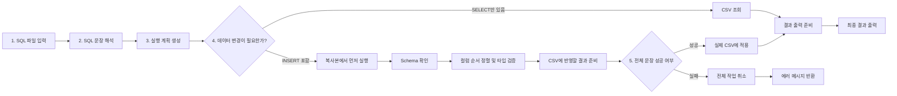

# SQL_WednsdayCodingClub

CSV 기반 미니 SQL Processor를 직접 구현한 C11 프로젝트입니다.  
하나의 SQL 파일을 읽어 `INSERT`와 `SELECT`를 파싱하고, schema 규칙에 맞게 CSV 데이터를 안전하게 조회하거나 반영합니다.

## 기획 의도

이 프로젝트는 "SQL이 실제로 어떻게 읽히고 실행되는가"를 직접 구현하며 이해하는 것을 목표로 시작했습니다.

- SQL 문장을 라이브러리에 맡기지 않고 수동 스캐너로 직접 파싱합니다.
- 데이터 저장소를 복잡한 DB 엔진 대신 `CSV + schema.csv` 조합으로 단순화했습니다.
- 실행 과정에서는 staging, commit, rollback 개념을 넣어 데이터 안정성을 학습할 수 있도록 설계했습니다.

즉, 이 프로젝트는 단순한 문법 실습이 아니라 `파서`, `AST`, `실행기`, `스토리지`, `트랜잭션 비슷한 흐름`까지 하나의 작은 시스템으로 묶어 보는 데 의미가 있습니다.

## 서비스 소개

`SQL_WednsdayCodingClub`은 SQL 파일을 받아 CSV 데이터를 조작하거나 조회하는 CLI 프로그램입니다.

- `INSERT INTO [schema.]table VALUES (...);`
- `INSERT INTO [schema.]table (col1, col2, ...) VALUES (...);`
- `SELECT * FROM [schema.]table;`
- `SELECT col1, col2 FROM [schema.]table;`
- 한 SQL 파일 안에 여러 문장을 순서대로 실행할 수 있습니다.

이 프로젝트는 다음 상황을 다룹니다.

- schema가 존재할 때 컬럼 이름 기반 INSERT 재정렬
- schema 타입 검증 (`INT`, `STRING`)
- projection SELECT
- staging 디렉터리를 통한 all-or-nothing 실행

## 프로젝트 흐름



프로젝트는 아래 흐름으로 동작합니다.

1. `main.c`가 SQL 파일 전체를 읽고 실행에 사용할 `data_dir`를 결정합니다.
2. `parser.c`가 SQL 스크립트를 수동 스캐너 방식으로 읽어 `Statement`, `SqlScript` AST로 변환합니다.
3. `execute.c`가 각 문장을 순서대로 실행합니다.
4. `INSERT`가 포함된 경우 staging 디렉터리에서 먼저 실행해 원본 데이터 변경을 지연합니다.
5. `storage.c`가 CSV와 schema 파일을 읽어 타입 검증, 컬럼 매핑, append, projection SELECT를 처리합니다.
6. 모든 문장이 성공하면 commit, 하나라도 실패하면 rollback합니다.

## 핵심 개념

### 1. Manual Scanner Parser

이 프로젝트는 `strtok` 같은 단순 분리 대신 직접 위치를 추적하는 parser를 사용합니다.

- 대소문자 구분 없는 키워드 처리
- 식별자 파싱
- 정수 / 문자열 리터럴 파싱
- `''` 문자열 escape 처리
- 여러 SQL 문장의 세미콜론 경계 처리

### 2. AST 기반 실행 구조

파싱 결과는 곧바로 실행되지 않고 AST로 정리됩니다.

- `Statement`
  - 문장 타입
  - schema / table
  - column list
  - values
- `SqlScript`
  - 여러 `Statement`를 순서대로 담는 스크립트 단위 구조

이 구조 덕분에 파싱과 실행 책임이 분리되어 코드가 더 명확해졌습니다.

### 3. CSV + Schema 저장소 모델

테이블은 CSV 파일, 구조 정보는 별도의 schema CSV 파일로 관리합니다.

- `users` -> `users.csv`, `users.schema.csv`
- `app.users` -> `app__users.csv`, `app__users.schema.csv`

schema 파일 형식 예시는 아래와 같습니다.

```csv
name,type
id,INT
name,STRING
age,INT
```

### 4. Staging / Commit / Rollback

여러 문장을 실행할 때는 원본 `data/`를 바로 수정하지 않습니다.

- 먼저 staging 디렉터리로 필요한 CSV와 schema를 복사
- staging에서 전체 스크립트 실행
- 전부 성공하면 실제 데이터에 반영
- 중간 실패 시 staging 폐기

이 방식으로 "하나 성공, 하나 실패" 같은 어중간한 상태를 막습니다.

## 트러블 슈팅 / 기술적 챌린지

### 1. 문자열과 세미콜론을 안전하게 파싱하기

SQL은 공백, 개행, 대소문자, 문자열 리터럴, 세미콜론 경계를 함께 처리해야 합니다.  
단순 토큰 분리 방식으로는 quoted string과 statement boundary를 안정적으로 다루기 어렵기 때문에 직접 scanner를 구현했습니다.

### 2. Column-name INSERT와 schema 순서 맞추기

`INSERT INTO users (name, id, age) VALUES ('alice', 1, 20);` 같은 입력은 SQL에 적힌 순서와 실제 CSV 헤더 순서가 다를 수 있습니다.  
이를 해결하기 위해 schema를 기준으로 컬럼 인덱스를 찾아 값을 재배치한 뒤 append하도록 만들었습니다.

### 3. CSV 자동 생성의 조건 통제

schema가 있다고 해서 아무 경우에나 CSV를 새로 만들면 잘못된 데이터가 생길 수 있습니다.  
그래서 다음 조건일 때만 auto-create를 허용했습니다.

- schema 파일이 존재할 것
- explicit column list INSERT일 것
- schema의 모든 컬럼이 정확히 포함될 것

### 4. 여러 문장 실행 시 출력과 데이터 일관성 맞추기

데이터만 rollback되고 콘솔 출력은 이미 나가버리면 사용자는 성공처럼 오해할 수 있습니다.  
이를 막기 위해 실행 결과도 임시 버퍼에 쌓아 두었다가 전체 성공 후에만 최종 출력하도록 설계했습니다.

## 사용 방법

### 실행 형식

```bash
./sql_processor <sql_file> [data_dir]
```

- `sql_file`: 실행할 SQL 스크립트 파일
- `data_dir`: CSV와 schema 파일이 들어 있는 디렉터리
- 생략 시 기본값은 `data/`

### 예시

```bash
./sql_processor queries/select_users.sql
./sql_processor queries/select_user_names.sql
./sql_processor queries/script_users_roundtrip.sql
```

### 빌드

기본 빌드 도구는 `Makefile`입니다.

```bash
make clean all
```

### 테스트

```bash
make test
```

### 샘플 데이터와 쿼리

- `data/users.csv`
- `data/users.schema.csv`
- `queries/insert_users.sql`
- `queries/insert_users_with_columns.sql`
- `queries/select_users.sql`
- `queries/select_user_names.sql`
- `queries/script_users_roundtrip.sql`

### 지원 범위

현재 지원 범위는 다음과 같습니다.

- `INSERT`
- `SELECT`
- explicit column INSERT
- projection SELECT
- multi-statement script
- schema 기반 타입 검증

현재 지원하지 않는 기능은 다음과 같습니다.

- `WHERE`
- `NULL`
- `UPDATE`, `DELETE`
- 집계, 정렬, 조인

## 프로젝트 구조

```text
include/
  execute.h
  parse.h
  sql_common.h
  sql_error.h
  sql_processor.h
  sql_types.h
  storage.h
src/
  main.c
  parser.c
  statement.c
  sql_error.c
  execute.c
  storage.c
tests/
  test_parser.c
data/
queries/
docs/
```
