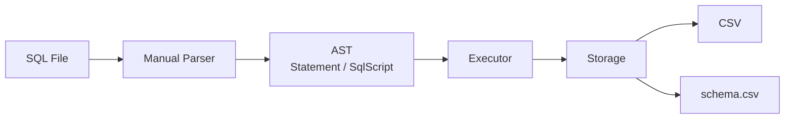
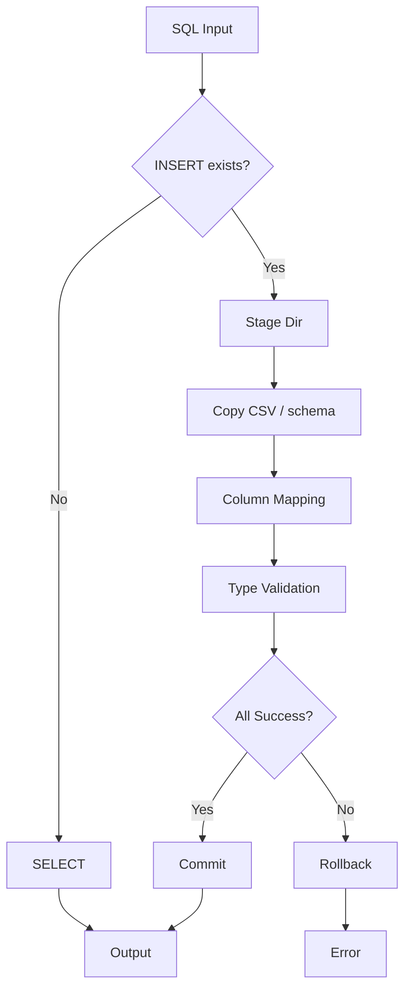

# SQL_WednsdayCodingClub

### CSV 기반 Mini SQL Processor

---

## 프로젝트 소개

우리 프로젝트는 SQL 파일을 읽어 CSV 데이터를 조회하고 반영하는 미니 SQL 처리기입니다.  
SQL 파일 안의 `INSERT`와 `SELECT` 문장을 파싱하고, schema 규칙에 맞게 CSV 데이터를 안전하게 조회하거나 반영하도록 구현했습니다.

현재 프로젝트는 실제 DB 엔진 전체를 구현하는 것이 아니라, 제한된 SQL 문법이 어떤 흐름으로 읽히고 실행되는지를 직접 확인할 수 있도록 만드는 데에 초점을 두었습니다.

---

## 구조도

---

## 핵심 설계

| 설계 포인트 | 선택한 방식 | 이유 |
|---|---|---|
| SQL 파싱 | **수동 스캐너 직접 구현** | 괄호, 쉼표, 여러 문장 경계를 현재 지원 문법 안에서 일관되게 처리함 |
| 스키마 관리 | **테이블 CSV와 schema CSV 분리** | 스키마 정보는 CSV 파일 하나만으로 관리하기 힘듦  |
| 다중 문장 실행 | **Rollback 기능** | 복사본에서 끝까지 실행한 뒤 전부 성공했을 때만 실제 데이터에 반영됨 |

---

## 지원 기능

| 구분 | 내용 |
|---|---|
| `INSERT` | `INSERT INTO table VALUES (...);` |
| `INSERT` | `INSERT INTO table (col1, col2, ...) VALUES (...);` |
| `SELECT` | `SELECT * FROM table;` |
| `SELECT` | `SELECT col1, col2 FROM table;` |
| Multi-statement | SQL 파일 하나에 여러 문장 실행 가능 |
| Schema validation | 타입 검증, 컬럼 순서 재정렬, projection 검증 지원 |

---

## 플로우차트

---

## 시연 포인트

| 시연 내용 | 확인할 수 있는 점 |
|---|---|
| `INSERT INTO users (name, id, age) ...` | 입력 컬럼 순서가 달라도 schema 순서에 맞게 재정렬되어 저장됩니다. |
| `SELECT name, age FROM users;` | 필요한 컬럼만 projection 형태로 조회할 수 있습니다. |
| `INSERT ...; INSERT bad ...;` | 여러 문장 중 하나가 실패하면 전체 작업이 rollback되어 원본 데이터가 그대로 유지됩니다. |

---

## 협업 방식

**코드 리뷰를 활용한 협업**
1. 명세서를 작성해 구현 범위와 동작 정리
2. Codex를 활용한 구현
3. 팀원 모두 같은 화면을 보며 코드 분석

---

## 한계

이 프로젝트는 학습 목적의 미니 SQL 처리기이므로 `WHERE`, `JOIN`, `UPDATE`, `DELETE`, 정렬, 집계 같은 고급 기능은 아직 지원하지 않습니다. 대신 현재 범위 안에서 파싱, schema 검증, 다중 문장 처리, rollback 흐름이 명확하게 드러나도록 구현했습니다.
