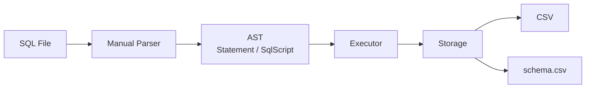
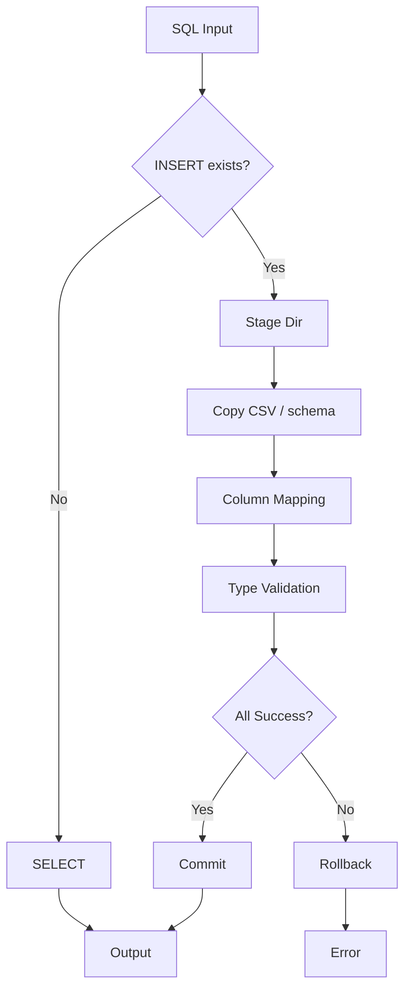

# SQL_WednsdayCodingClub

### CSV 기반 Mini SQL Processor

**Manual Parser** · **AST** · **Schema-Aware CSV** · **Staging Rollback**

---

## What It Is

<table>
  <tr>
    <td align="center" width="25%">
      <b>직접 만든 Parser</b> 
      SQL을 라이브러리 없이 해석
    </td>
    <td align="center" width="25%">
      <b>AST 실행 구조</b> 
      문장 → 구조 → 실행
    </td>
    <td align="center" width="25%">
      <b>CSV + schema.csv</b> 
      단순 저장 + 타입 검증
    </td>
    <td align="center" width="25%">
      <b>Rollback 가능</b> 
      실패 시 전체 취소
    </td>
  </tr>
</table>

---

## Why This Project

<table>
  <tr>
    <td align="center" width="33%">
      <b>문법</b> 
      SQL이 실제로 
      어떻게 읽히는가
    </td>
    <td align="center" width="33%">
      <b>구조</b> 
      Parser / Execute / Storage 
      책임 분리
    </td>
    <td align="center" width="33%">
      <b>안정성</b> 
      Stage → Validate → Commit 
      실패 시 Rollback
    </td>
  </tr>
</table>

---

## System Map

---

## Execution Flow

---

## Design Choices

| Decision | Choice | Reason |
|---|---|---|
| Storage | **CSV** | 구조가 보인다 |
| Schema | **별도 schema.csv** | 타입 검증 가능 |
| Parser | **Manual Scanner** | SQL 해석 흐름이 드러난다 |
| Execution | **Script 단위** | 여러 문장 시연 가능 |
| Reliability | **Stage + Rollback** | 중간 상태를 남기지 않는다 |

---

## Core Capabilities

<table>
  <tr>
    <td align="center" width="33%">
      <b>Parser</b>  
      Keyword Parsing 
      String Escape <code>''</code> 
      AST Build
    </td>
    <td align="center" width="33%">
      <b>Execution</b>  
      Multi-Statement 
      Buffered Output 
      Atomic-Like Flow
    </td>
    <td align="center" width="33%">
      <b>Storage</b>  
      CSV Auto Create 
      Column Reordering 
      Type Validation
    </td>
  </tr>
</table>

---

## Strengths vs Limits

| Strengths | Limits |
|---|---|
| SQL 처리 흐름이 코드로 선명하다 | 실제 DB 엔진은 아니다 |
| AST 기반으로 구조가 명확하다 | `WHERE`, `JOIN`, `UPDATE` 미지원 |
| CSV인데도 schema 검증이 된다 | CSV 자체의 확장성 한계 |
| Rollback 개념까지 직접 보여줄 수 있다 | 학습성 우선, 성능 최적화 아님 |

---

## Demo Focus

<table>
  <tr>
    <td align="center" width="33%">
      <b>INSERT</b> 
      컬럼 이름 기반 매핑
    </td>
    <td align="center" width="33%">
      <b>SELECT</b> 
      특정 컬럼 조회
    </td>
    <td align="center" width="33%">
      <b>ROLLBACK</b> 
      실패 시 전체 취소
    </td>
  </tr>
</table>

| Demo | Visible Result |
|---|---|
| `INSERT INTO users (name, id, age) ...` | schema 순서로 재정렬 저장 |
| `SELECT name, age FROM users;` | projection 출력 |
| `INSERT ...; INSERT bad ...;` | rollback |

---

## Detail Links

- [CLI_DEMO_SCENARIOS.md](./CLI_DEMO_SCENARIOS.md)
- [PHASE3_IMPLEMENTATION_NOTES.md](./PHASE3_IMPLEMENTATION_NOTES.md)
- [INTERVIEW_QUESTIONS.md](./INTERVIEW_QUESTIONS.md)

---

## One Line

### **"CSV를 읽고 쓰는 프로젝트가 아니라, SQL을 해석하고 안전하게 실행하는 구조를 직접 만든 프로젝트"**

