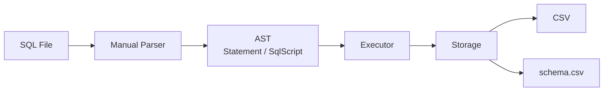
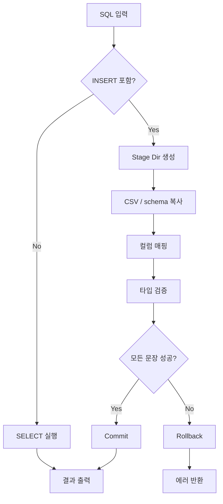

# SQL_WednsdayCodingClub

> **CSV를 Mini DB처럼 다루는 C SQL Processor**  
> **Manual Parser | AST | Schema-Aware CSV | Staging Rollback**

## 프로젝트 특징

| Feature | Why It Matters |
|---|---|
| **Manual Scanner Parser** | SQL을 라이브러리 없이 직접 읽는다 |
| **AST + Script Execution** | 문장 1개가 아니라 스크립트 단위로 실행한다 |
| **CSV + schema.csv** | DB 없이도 타입 검증과 컬럼 매핑이 가능하다 |
| **Staging / Commit / Rollback** | 여러 SQL 문장을 all-or-nothing으로 보장한다 |

## 요약

**"단순 CSV CRUD가 아니라, SQL 파싱부터 실행 안정성까지 직접 만든 작은 DB"**

## 구조도

## 실행 흐름

## 의사결정 흐름

| 질문 | 선택 | 이유 |
|---|---|---|
| DB를 쓸까? | **CSV** | 구조를 눈으로 보기 쉽다 |
| 타입 정보는? | **schema.csv** | 헤더만으로는 검증이 부족하다 |
| SQL 실행 단위는? | **Script** | 여러 문장 흐름을 보여줄 수 있다 |
| 실패 처리 방식은? | **Stage + Rollback** | 중간 상태를 남기지 않는다 |
| 파서 방식은? | **Manual Scanner** | SQL이 실제로 읽히는 흐름이 드러난다 |

## 핵심 기술

| Parser | Execution | Storage |
|---|---|---|
| Keyword Parsing | Multi-Statement | CSV Auto Create |
| String Escape `''` | Buffered Output | Column Reordering |
| AST Build | Atomic-Like Flow | Type Validation |

## 장점 / 한계

| 장점 | 한계 |
|---|---|
| SQL 처리 흐름이 코드로 명확하게 보인다 | 실제 DB 엔진은 아니다. |
| Parser / Execute / Storage가 분리돼 있다 | `WHERE`, `JOIN`, `UPDATE` 미지원 |
| CSV인데도 schema 기반 검증이 가능하다 | CSV 구조 자체의 확장성 한계가 있다 |
| Rollback 개념까지 직접 시연할 수 있다 | 성능 최적화보다 학습성과 구조 명확성이 우선이다 |

## 데모 시연

1. **컬럼 이름 기반 INSERT**  
   `name, id, age`로 넣어도 schema 순서로 저장
2. **특정 컬럼 SELECT**  
   `SELECT name, age FROM users;`
3. **실패 시 Rollback**  
   앞 문장이 성공해도 뒤 문장이 실패하면 전체 취소

## 예상 결과

| Demo | Visible Result |
|---|---|
| `INSERT INTO users (name, id, age) ...` | 컬럼 순서 재정렬 |
| `SELECT name, age FROM users;` | Projection 출력 |
| `INSERT ...; INSERT bad ...;` | Rollback |