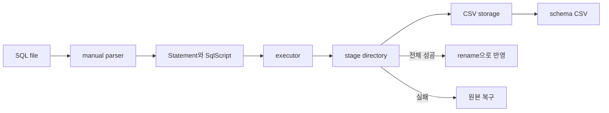

# CSVQueryEngine

SQL 파일을 읽어 CSV table을 조회하고 수정하는 C 기반 mini SQL processor입니다. 수동 parser, schema 검증, 여러 문장을 한 번에 처리하는 rollback 흐름까지 구현했습니다.

세 프로젝트로 이어지는 SQL 엔진 구현의 첫 단계입니다. 다음 단계에서는 B+Tree index와 binary storage를 추가하고, 마지막 단계에서는 concurrent API server로 확장합니다.

## 시작한 이유

SQL 문장이 parser, executor, storage를 거쳐 실제 데이터 변경으로 이어지는 과정을 직접 구현하며 DBMS의 기본 경계를 공부하려고 시작했습니다. 크래프톤 정글 수요코딩회에서 제한된 문법부터 안전하게 실행하는 데 집중했습니다.

## 핵심 기능

| 영역 | 구현 |
| --- | --- |
| Parser | INSERT, SELECT, 여러 문장, quoted string |
| AST | Statement와 SqlScript, 명시적인 memory ownership |
| Schema | column 이름과 int, string type 검증 |
| Storage | CSV 조회, 추가, projection, 자동 생성 |
| Batch | stage directory에서 전체 문장 실행 |
| Rollback | 문장이나 output 실패 시 원본 CSV 복구 |

## 아키텍처와 코드 구조


```mermaid
flowchart LR
    FILE[SQL file] --> PARSER[manual parser]
    PARSER --> AST[Statement와 SqlScript]
    AST --> EXEC[executor]
    EXEC --> STAGE[stage directory]
    STAGE --> STORE[CSV storage]
    STORE --> SCHEMA[schema CSV]
    STAGE -->|전체 성공| COMMIT[rename으로 반영]
    STAGE -->|실패| ROLLBACK[원본 복구]
```

| 경로 | 역할 |
| --- | --- |
| `src/parser.c` | token과 문장 경계를 읽어 AST 생성 |
| `src/statement.c` | AST 초기화와 memory 해제 |
| `src/execute.c` | 문장 실행, staging, commit과 rollback |
| `src/storage.c` | CSV와 schema 읽기, 검증, 직렬화 |
| `tests/test_parser.c` | parser와 실행 경계 회귀 검사 |

## 문제 해결 과정

### 문자열과 구두점을 보존하는 수동 scanner

`strtok`는 입력을 바꾸고 현재 위치를 잃기 때문에 quoted string, 괄호, 쉼표, semicolon의 오류 위치를 정확히 표시하기 어려웠습니다. 입력과 현재 index를 가진 parser를 만들고 필요한 문자만 소비하도록 구성했습니다.

쉼표 뒤에 값 없이 괄호가 닫히는 경우와 중복 column 이름을 즉시 거부했습니다. Windows에서 만든 SQL 파일의 UTF-8 BOM은 첫 token을 읽기 전에 건너뛰어 같은 query가 운영체제에 따라 실패하지 않게 했습니다.

### column 순서와 schema 순서 맞추기

`INSERT INTO users (name, id, age)`처럼 입력 순서가 schema와 다르면 값을 그대로 저장할 수 없습니다. column 이름을 schema index에 대응시킨 뒤 값을 table 순서로 재배열하고, 빠진 column과 type을 함께 검사했습니다.

projection SELECT도 요청 column의 index를 먼저 찾고 각 row에서 같은 위치만 출력했습니다. `SELECT *`도 raw copy 대신 row를 다시 읽어 header와 field 수가 다른 CSV를 거부했습니다.

### 여러 문장을 원본과 분리해 실행

첫 번째 INSERT가 성공한 뒤 두 번째 문장이 실패하면 앞선 변경만 남을 수 있습니다. 원본 CSV를 stage directory로 복사해 모든 문장을 그 안에서 실행하고, 끝까지 성공한 경우에만 임시 파일을 rename해 반영했습니다.

commit 도중 또는 결과 출력에서 오류가 나면 backup을 이용해 이미 반영한 table도 되돌립니다. 실행 결과 역시 buffer에 모아 batch가 성공한 뒤 출력합니다.

### 동적 목록 확장 시 overflow 확인

Statement와 column 목록을 `realloc`으로 늘릴 때 count 곱셈이 overflow되면 필요한 크기보다 작은 buffer가 생길 수 있습니다. 새 크기를 계산하기 전에 `SIZE_MAX` 경계를 확인하고, 실패하면 부분 AST를 정리하도록 했습니다.

## 기여

팀 프로젝트에서 저는 SQL 처리 흐름의 초기 구현과 확장을 맡았습니다.

- 수동 parser와 AST ownership 규칙
- CSV executor와 storage 계층 분리
- schema 기반 column mapping과 type validation
- 여러 문장 처리와 staging rollback 기반 구성
- BOM, trailing comma, 동적 배열 overflow 경계 처리

최종 commit과 rollback의 I/O edge case는 팀원이 함께 보강했습니다.

## 실행 방법

GCC와 Make가 있는 Linux 환경에서 실행합니다.

```bash
make
./sql_processor queries/script_users_roundtrip.sql data
```

## 테스트

```bash
make clean
make test
```

현재 17개 회귀 시나리오가 parser, schema mapping, projection, batch rollback, malformed CSV와 output 실패를 검사합니다.

## 남은 과제

- WHERE 조건과 UPDATE, DELETE 문법 추가
- 여러 process가 같은 CSV를 수정할 때의 lock 설계
- B+Tree index를 이용한 조회 경로 추가

## 관련 프로젝트

- [BPlusTreeQueryEngine](https://github.com/NearthYou/BPlusTreeQueryEngine): B+Tree index와 binary storage를 추가한 다음 단계
- [ConcurrentSQLServer](https://github.com/NearthYou/ConcurrentSQLServer): transaction과 thread pool을 갖춘 최종 단계
